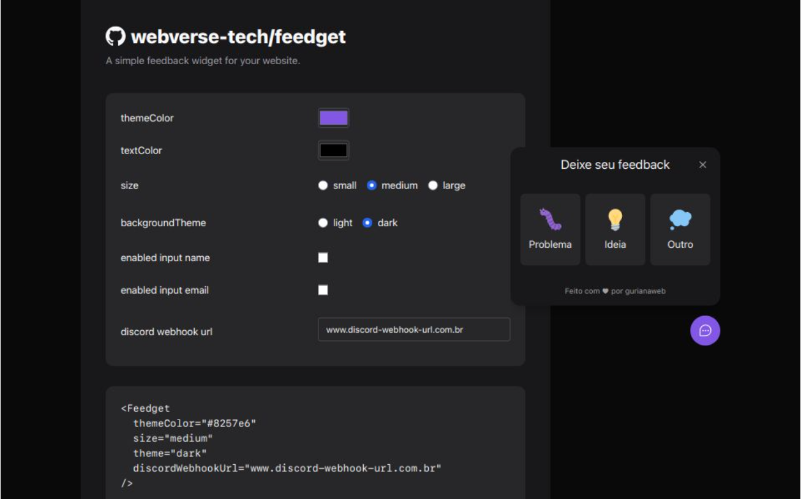

# 

<h1 align="center">
  Feedget - Feedback Widget | ReactJS
</h1>

<p align="center">
  <a href="#-recursos">Recursos</a>&nbsp;&nbsp;&nbsp;|&nbsp;&nbsp;&nbsp;
  <a href="#-demo">Demo</a>&nbsp;&nbsp;&nbsp;|&nbsp;&nbsp;&nbsp;
  <a href="#instalação">Instalação</a>
</p>

<br>

**Feedget** é um widget de feedback que permite aos usuários enviar mensagens diretamente para um canal do Discord. Este widget é fácil de configurar e não requer backend. Basta conectar a URL do webhook do Discord para começar a receber feedbacks em seu canal.



## 💣 Recursos

- **Configuração Simples:** Envie feedbacks diretamente para o Discord com apenas um webhook.
- **Sem Backend Necessário:** Funciona totalmente no frontend, sem necessidade de servidor.
- **Personalização:** Customize o widget de acordo com suas necessidades:
  - **Cores:** Altere as cores do widget para combinar com o design do seu site.
  - **Tema:** Escolha entre temas claro e escuro.
  - **Tamanho do Botão:** Ajuste o tamanho do botão de feedback para se adequar ao layout.
  - **Campos Adicionais:** Adicione campos opcionais para nome e/ou e-mail.
- **Demo Disponível:** Experimente o widget antes de implementar em seu projeto.


## 💻 Demo
Para testar o widget antes de integrá-lo ao seu projeto, visite nossa [demo](https://webverse-tech-feedget.vercel.app/).

<br/>

## Instalação

Você pode instalar o pacote `feedget` usando npm:

```bash
npm install @webverse-tech/feedget
```

Ou se preferir usar yarn:

```bash
yarn add @webverse-tech/feedget
```

## Configuração

1. **Obtenha o Webhook do Discord:**
   - Vá para seu servidor Discord e crie um webhook no canal onde você deseja receber os feedbacks.
   - Copie a URL do webhook.

2. **Configure o Widget:**
   - Importe e configure o widget em seu projeto. Use a URL do webhook para conectar o widget ao seu canal do Discord.

   ```javascript
   import Feedget from '@webverse-tech/feedget';

   function App() {
     return (
       <div>
         <Feedget discordWebhookUrl="SUA_URL_DO_WEBHOOK_AQUI" />
       </div>
     );
   }

   export default App;
   ```

   Substitua `"SUA_URL_DO_WEBHOOK_AQUI"` pela URL do webhook do Discord que você obteve.


## Opções de Personalização

Customize o widget de acordo com suas necessidades. Veja as opções abaixo:

  | Opção            | Descrição                                         | type             | default        | accept                                         |
  |------------------|---------------------------------------------------|------------------|----------------|------------------------------------------------|
  | `themeColor`     | Altere a cor de destaque.                         | string           | '#8257e6'      | Cores em formato hexadecimal (ex: `#8257e6`)   |
  | `textColor`      | Altere a cor do texto.                            | string           | '#ffffff'      | Cores em formato hexadecimal (ex: `#000000`)   |
  | `size`           | Ajuste o tamanho do botão de feedback.            | string           | 'medium'       | `"small"`, `"medium"`, `"large"`               |
  | `theme`          | Escolha entre temas claro e escuro.               | string           |  dark'         | `"dark"` ou `"light"`                          |
  | `isEnabledName`  | Adicione um campo opcional para nome.             | boolean          |  `false`       |                                                |
  | `isEnabledEmail` | Adicione um campo opcional para e-mail.           | boolean          |  `false`       |                                                |
  
<br/>

## 🧪 Tecnologias

Esse projeto foi desenvolvido com as seguintes tecnologias:

- [ReactJS](https://pt-br.reactjs.org/)
- [TypeScript](https://www.typescriptlang.org/)
- [TailwindCSS](https://tailwindcss.com/)

## Contribuição

Se você deseja contribuir para o desenvolvimento do feedget, sinta-se à vontade para abrir issues e pull requests. Estamos abertos a melhorias e sugestões!

## Licença

Este projeto está licenciado sob a licença ISC. Veja o arquivo [LICENSE](LICENSE) para mais detalhes.

> [!NOTE]  
> Este projeto foi aprimorado a partir da NLW #8, evento da Rocketseat
---

<h4 align="center"> Feito com ♥ por Beatriz Paixão (gurianaweb) </h4>
